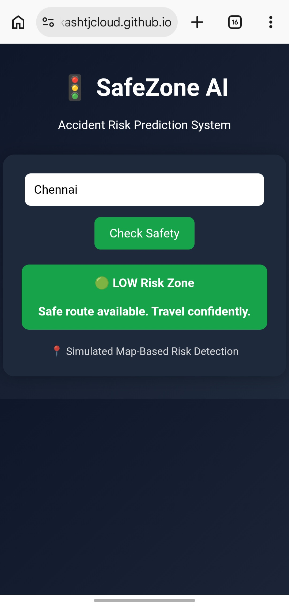

🚦 SafeZone AI

Accident Risk Prediction & Prevention System

💡 Overview

SafeZone AI helps users identify accident-prone zones and choose safer routes instead of just faster ones.

🚀 Features

- Risk Zone Detection (Low / Medium / High)
- Smart Safety Suggestions
- User-friendly Interface
- Preventive Approach (not reactive)

🧠 How It Works

User enters location → System analyzes risk → Displays safety level → Suggests safer route

🎯 Goal

To reduce road accidents and save lives using AI-driven insights.

👨‍💻 Team

Faith Coders

## 🔗 Live Demo
https://akashtjcloud.github.io/safezone-ai

## 📸 Demo Preview
